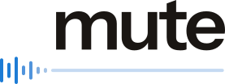

<p align="center">
    <picture>
        <source media="(prefers-color-scheme: dark)" srcset="assets/mute-lockup-on-dark.svg">
        <source media="(prefers-color-scheme: light)" srcset="assets/mute-lockup-on-light.svg">
        
    </picture>
</p>

&nbsp;

<p align="center">
    A tray application that mutes your microphone and deafens your speakers on Windows and Linux, with a hotkey and an on-screen panel.
</p>

<p align="center">
    <a href="https://github.com/braycarlson/mute/actions/workflows/ci.yml"></a>
    <a href="https://ziglang.org"></a>
    <a href="LICENSE"></a>
</p>

## Overview

mute gives you one key that silences your microphone. The key is `PageUp`, the tray icon
states whether the microphone is muted, and a second binary called `deafen` does the same
for your speakers on `PageDown`. The key is read before the rest of the system sees it, so
a full-screen application cannot swallow it.

## Features

- **On-screen panel**: A click on the tray icon opens a panel in the corner with a volume
  slider, a mute button, and arrows for stepping between devices.
- **Volume on adoption**: The configured level is written whenever a device is taken up,
  at startup and on every device change, so a machine that swaps microphones lands at a
  usable level.
- **Device changes**: The audio backend reports devices appearing, disappearing, and
  changing default, so the tray icon and the panel follow the machine.
- **Pinned device**: A name in the configuration pins the toggle to one device.
- **Live configuration**: The file is watched, so an edited hotkey or volume takes effect
  without a restart.

## Install

Each tagged release carries a Linux and a Windows build of both binaries.

The build from source looks for [kalymma](https://github.com/braycarlson/kalymma),
[mantra](https://github.com/braycarlson/mantra),
[nimble](https://github.com/braycarlson/nimble), and
[umbra](https://github.com/braycarlson/umbra) in the same parent directory, since
`build.zig.zon` points at them by relative path. It fetches
[arc](https://github.com/braycarlson/arc) by URL.

```
git clone https://github.com/braycarlson/kalymma
git clone https://github.com/braycarlson/mantra
git clone https://github.com/braycarlson/nimble
git clone https://github.com/braycarlson/umbra
git clone https://github.com/braycarlson/mute
cd mute
zig build -Doptimize=ReleaseSafe
```

Both binaries land in `zig-out/bin`. mute requires Zig 0.16.0.

## Usage

Either binary sits in the tray and waits for its hotkey. The capture side reports itself
as muted or unmuted, and the render side as deafened or undeafened.

| Binary | Device | Default hotkey | Default volume |
|---|---|---|---|
| `mute` | The capture device. | The `PageUp` key. | The level 0.7. |
| `deafen` | The render device. | The `PageDown` key. | The level 0.3. |

Linux needs the `nimbled` daemon from [nimble](https://github.com/braycarlson/nimble),
which its `contrib/systemd` installer sets up along with the `uinput` permission.

## Configuration

The file is `config.zon` under the platform's configuration directory, and both binaries
read the same file. A missing section falls back to the defaults above.

```zig
.{
    .capture = .{
        .hotkey = "PageUp",
        .name = "Microphone",
        .volume = 0.7,
    },
    .render = .{
        .hotkey = "PageDown",
        .volume = 0.3,
    },
}
```

The `name` entry pins the application to one device by name, so a machine that gains a
webcam microphone does not move the toggle onto it.

## Development

The build produces two binaries from one source tree, each with its own icons, hotkey, and
default volume. The panel draws into a plain pixel buffer, with the glyphs baked from a
font at build time rather than drawn by a text stack.

The recipes below wrap `zig build`, and a bare `just` lists them all. The tidy law is a
test rather than a separate linter, so the mechanical rules run with everything else.

| Command | What it runs |
|---|---|
| `just ci` | The formatting check, compilation, and the test suites. |
| `just test` | The unit tests and the mock suite. |
| `just tidy` | The tidy law on its own. |
| `just run` | The application from source. |
| `just atlas` | The glyph atlas regeneration through `tool/atlas.py`. |
| `just check-windows` | The compile of every artifact for Windows from any host. |

## Licence

MIT. See [LICENSE](LICENSE). The panel's glyph masks are derived from DejaVu Sans, whose
notice is carried in [NOTICE](NOTICE).
